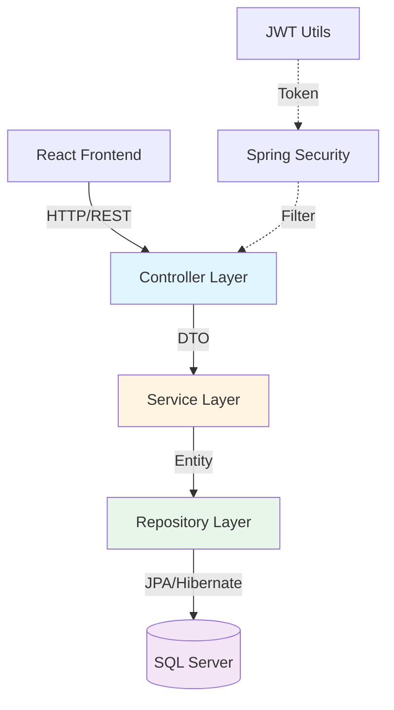
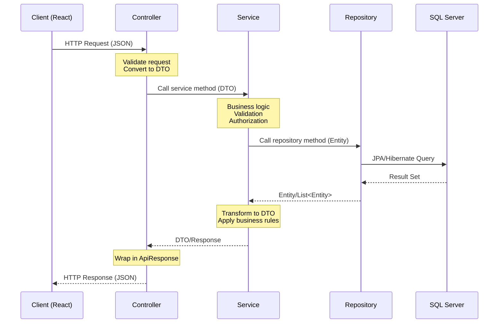

# Design Document: Study Task Manager - Backend Setup (Phase 1)

## Tổng quan (Overview)

Study Task Manager là một web application quản lý task học tập/công việc cá nhân được xây dựng với Spring Boot (backend), React (frontend), và SQL Server (database). Document này tập trung vào Phase 1: Backend Setup - thiết lập cấu trúc project, kết nối database, và tạo các entities cơ bản.

**Mục tiêu Phase 1:**
- Tạo Spring Boot project với cấu trúc module-based rõ ràng
- Cấu hình kết nối SQL Server database
- Tạo 5 entities tương ứng với database schema (User, Role, Category, Task, UserRole)
- Tạo repositories cho từng entity
- Test database connection thành công

**Tech Stack:**
- Java 22
- Spring Boot 3.x
- Spring Data JPA
- SQL Server
- Lombok (giảm boilerplate code)

## Kiến trúc tổng thể (High-Level Architecture)

### Layered Architecture

Study Task Manager sử dụng kiến trúc phân lớp (Layered Architecture) chuẩn của Spring Boot:



### Backend Structure - Layered Architecture

Project được tổ chức theo **layered architecture** (kiến trúc phân lớp), các class cùng loại được nhóm vào cùng một package:

```
backend/
├── src/main/java/com/example/studytaskmanager/
│   ├── StudyTaskManagerApplication.java          # Main application class
│   │
│   ├── entity/                                   # Entity Layer - Database mapping
│   │   ├── User.java                            # users table
│   │   ├── Role.java                            # roles table
│   │   ├── Category.java                        # categories table
│   │   └── Task.java                            # tasks table
│   │
│   ├── enums/                                    # Enums cho status, priority
│   │   ├── TaskStatus.java                      # TODO, IN_PROGRESS, DONE
│   │   ├── TaskPriority.java                    # LOW,MEDIUM, HIGH
│   │   └── RoleName.java                        # USER, ADMIN
│   │
│   ├── repository/                               # Repository Layer - Data access
│   │   ├── UserRepository.java
│   │   ├── RoleRepository.java
│   │   ├── CategoryRepository.java
│   │   └── TaskRepository.java
│   │
│   ├── service/                                  # Service Layer - Business logic
│   │   ├── UserService.java
│   │   ├── AuthService.java
│   │   ├── CategoryService.java
│   │   └── TaskService.java
│   │
│   ├── controller/                               # Controller Layer - REST API
│   │   ├── AuthController.java                  # /api/auth/*
│   │   ├── UserController.java                  # /api/users/*
│   │   ├── CategoryController.java              # /api/categories/*
│   │   └── TaskController.java                  # /api/tasks/*
│   │
│   ├── dto/                                      # Data Transfer Objects
│   │   ├── auth/
│   │   │   ├── LoginRequest.java
│   │   │   ├── RegisterRequest.java
│   │   │   └── AuthResponse.java
│   │   ├── user/
│   │   │   ├── UserProfileDto.java
│   │   │   └── UpdateProfileRequest.java
│   │   ├── category/
│   │   │   ├── CategoryDto.java
│   │   │   ├── CreateCategoryRequest.java
│   │   │   └── UpdateCategoryRequest.java
│   │   └── task/
│   │       ├── TaskDto.java
│   │       ├── CreateTaskRequest.java
│   │       ├── UpdateTaskRequest.java
│   │       └── TaskFilterRequest.java
│   │
│   ├── security/                                 # Security configuration
│   │   ├── SecurityConfig.java                  # Spring Security config
│   │   ├── JwtTokenProvider.java                # JWT generation/validation
│   │   ├── JwtAuthenticationFilter.java         # JWT filter
│   │   └── UserDetailsServiceImpl.java          # Load user for authentication
│   │
│   ├── exception/                                # Exception handling
│   │   ├── ResourceNotFoundException.java
│   │   ├── BadRequestException.java
│   │   ├── UnauthorizedException.java
│   │   └── GlobalExceptionHandler.java          # @

│   │
│   ├── util/                                     # Utility classes
│   │   └── ResponseUtil.java                    # Helper cho API responses
│   │
│   └── config/                                   # Configuration classes
│       ├── DatabaseConfig.java                   # Database configuration
│       └── CorsConfig.java                       # CORS configuration
│
├── src/main/resources/
│   ├── application.yml                           # Main configuration
│   └── application-dev.yml                       # Development profile
│
└── pom.xml                                       # Maven dependencies
```

**Ưu điểm của Layered Architecture:**
- Dễ tìm file: Tất cả controllers ở một chỗ, services ở một chỗ
- Dễ học cho người mới: Cấu trúc rõ ràng, phân tách trách nhiệm
- Phù hợp với project vừa và nhỏ
- Dễ maintain khi team nhỏ

### Data Flow giữa các Layers



**Giải thích các layer:**

1. **Controller Layer**: Nhận HTTP requests, validate input, gọi service, trả về HTTP responses
2. **Service Layer**: Chứa business logic, xử lý transactions, authorization
3. **Repository Layer**: Tương tác với database thông qua JPA
4. **Entity Layer**: Mapping với database tables

## Chi tiết Implementation - Phase 1 (Low-Level Design)

### 1. Maven Dependencies (pom.xml)

```xml
<?xml version="1.0" encoding="UTF-8"?>
<project xmlns="http://maven.apache.org/POM/4.0.0"
         xmlns:xsi="http://www.w3.org/2001/XMLSchema-instance"
         xsi:schemaLocation="http://maven.apache.org/POM/4.0.0 
         https://maven.apache.org/xsd/maven-4.0.0.xsd">
    <modelVersion>4.0.0</modelVersion>
    
    <parent>
        <groupId>org.springframework.boot</groupId>
        <artifactId>spring-boot-starter-parent</artifactId>
        <version>3.2.1</version>
        <relativePath/>
    </parent>
    
    <groupId>com.example</groupId>
    <artifactId>study-task-manager</artifactId>
    <version>0.0.1-SNAPSHOT</version>
    <name>Study Task Manager</name>
    <description>Task management application for students</description>
    
    <properties>
        <java.version>22</java.version>
    </properties>
    
    <dependencies>
        <!-- Spring Boot Web - REST API -->
        <dependency>
            <groupId>org.springframework.boot</groupId>
            <artifactId>spring-boot-starter-web</artifactId>
        </dependency>
        
        <!-- Spring Data JPA - Database ORM -->
        <dependency>
            <groupId>org.springframework.boot</groupId>
            <artifactId>spring-boot-starter-data-jpa</artifactId>
        </dependency>
        
        <!-- SQL Server Driver -->
        <dependency>
            <groupId>com.microsoft.sqlserver</groupId>
            <artifactId>mssql-jdbc</artifactId>
            <scope>runtime</scope>
        </dependency>
        
        <!-- Lombok - Reduce boilerplate code -->
        <dependency>
            <groupId>org.projectlombok</groupId>
            <artifactId>lombok</artifactId>
            <optional>true</optional>
        </dependency>
        
        <!-- Validation -->
        <dependency>
            <groupId>org.springframework.boot</groupId>
            <artifactId>spring-boot-starter-validation</artifactId>
        </dependency>
        
        <!-- Spring Boot DevTools - Hot reload -->
        <dependency>
            <groupId>org.springframework.boot</groupId>
            <artifactId>spring-boot-devtools</artifactId>
            <scope>runtime</scope>
            <optional>true</optional>
        </dependency>
        
        <!-- Test dependencies -->
        <dependency>
            <groupId>org.springframework.boot</groupId>
            <artifactId>spring-boot-starter-test</artifactId>
            <scope>test</scope>
        </dependency>
    </dependencies>
    
    <build>
        <plugins>
            <plugin>
                <groupId>org.springframework.boot</groupId>
                <artifactId>spring-boot-maven-plugin</artifactId>
                <configuration>
                    <excludes>
                        <exclude>
                            <groupId>org.projectlombok</groupId>
                            <artifactId>lombok</artifactId>
                        </exclude>
                    </excludes>
                </configuration>
            </plugin>
        </plugins>
    </build>
</project>
```

**Giải thích dependencies:**
- `spring-boot-starter-web`: Tạo REST API
- `spring-boot-starter-data-jpa`: ORM để mapping Java objects với database
- `mssql-jdbc`: Driver kết nối SQL Server
- `lombok`: Tự động generate getters/setters, constructors
- `spring-boot-starter-validation`: Validate input data
- `spring-boot-devtools`: Auto reload khi code thay đổi

### 2. Database Configuration (application.yml)

```yaml
spring:
  application:
    name: study-task-manager
  
  datasource:
    url: jdbc:sqlserver://localhost:1433;databaseName=study_task_manager;encrypt=true;trustServerCertificate=true
    username: sa
    password: YourPassword123
    driver-class-name: com.microsoft.sqlserver.jdbc.SQLServerDriver
  
  jpa:
    hibernate:
      ddl-auto: validate
    show-sql: true
    properties:
      hibernate:
        dialect: org.hibernate.dialect.SQLServerDialect
        format_sql: true
    open-in-view: false

server:
  port: 8080
  servlet:
    context-path: /api

logging:
  level:
    com.example.studytaskmanager: DEBUG
    org.hibernate.SQL: DEBUG
    org.hibernate.type.descriptor.sql.BasicBinder: TRACE
```

**Giải thích config:**
- `datasource.url`: Connection string tới SQL Server
- `hibernate.ddl-auto: validate`: Chỉ validate schema, không tự động tạo/sửa tables
- `show-sql: true`: In SQL queries ra console để debug
- `context-path: /api`: Tất cả endpoints sẽ bắt đầu với `/api`

### 3. Enums

#### TaskStatus.java
```java
package com.example.studytaskmanager.enums;

public enum TaskStatus {
    TODO,
    IN_PROGRESS,
    DONE
}
```

#### TaskPriority.java
```java
package com.example.studytaskmanager.enums;

public enum TaskPriority {
    LOW,
    MEDIUM,
    HIGH
}
```

#### RoleName.java
```java
package com.example.studytaskmanager.enums;

public enum RoleName {
    USER,
    ADMIN
}
```

### 4. Entity Classes

#### User.java
```java
package com.example.studytaskmanager.entity;

import jakarta.persistence.*;
import lombok.*;
import org.hibernate.annotations.CreationTimestamp;
import org.hibernate.annotations.UpdateTimestamp;

import java.time.LocalDateTime;
import java.util.HashSet;
import java.util.Set;

@Entity
@Table(name = "users")
@Getter
@Setter
@NoArgsConstructor
@AllArgsConstructor
@Builder
public class User {
    
    @Id
    @GeneratedValue(strategy = GenerationType.IDENTITY)
    private Long id;
    
    @Column(nullable = false, unique = true, length = 50)
    private String username;
    
    @Column(nullable = false, unique = true, length = 100)
    private String email;
    
    @Column(name = "password_hash", nullable = false, length = 255)
    private String passwordHash;
    
    @Column(name = "display_name", length = 100)
    private String displayName;
    
    @Column(name = "is_active", nullable = false)
    private Boolean isActive = true;
    
    @CreationTimestamp
    @Column(name = "created_at", nullable = false, updatable = false)
    private LocalDateTime createdAt;
    
    @UpdateTimestamp
    @Column(name = "updated_at", nullable = false)
    private LocalDateTime updatedAt;
    
    // Many-to-Many relationship with Role
    @ManyToMany(fetch = FetchType.EAGER)
    @JoinTable(
        name = "user_roles",
        joinColumns = @JoinColumn(name = "user_id"),
        inverseJoinColumns = @JoinColumn(name = "role_id")
    )
    @Builder.Default
    private Set<Role> roles = new HashSet<>();
    
    // One-to-Many relationship with Category
    @OneToMany(mappedBy = "user", cascade = CascadeType.ALL, orphanRemoval = true)
    @Builder.Default
    private Set<Category> categories = new HashSet<>();
    
    // One-to-Many relationship with Task
    @OneToMany(mappedBy = "user", cascade = CascadeType.ALL, orphanRemoval = true)
    @Builder.Default
    private Set<Task> tasks = new HashSet<>();
}
```

**Giải thích annotations:**
- `@Entity`: Đánh dấu class này là JPA entity
- `@Table(name = "users")`: Map với table `users` trong database
- `@Id`: Primary key
- `@GeneratedValue(strategy = IDENTITY)`: Auto-increment ID
- `@Column`: Mapping với column trong database
- `@CreationTimestamp`: Tự động set thời gian tạo
- `@UpdateTimestamp`: Tự động update thời gian sửa
- `@ManyToMany`: Quan hệ nhiều-nhiều với Role
- `@OneToMany`: Quan hệ một-nhiều với Category và Task
- `@Builder.Default`: Khởi tạo giá trị mặc định khi dùng Builder pattern

#### Role.java
```java
package com.example.studytaskmanager.entity;

import com.example.studytaskmanager.enums.RoleName;
import jakarta.persistence.*;
import lombok.*;

import java.util.HashSet;
import java.util.Set;

@Entity
@Table(name = "roles")
@Getter
@Setter
@NoArgsConstructor
@AllArgsConstructor
@Builder
public class Role {
    
    @Id
    @GeneratedValue(strategy = GenerationType.IDENTITY)
    private Long id;
    
    @Enumerated(EnumType.STRING)
    @Column(nullable = false, unique = true, length = 30)
    private RoleName name;
    
    // Many-to-Many relationship with User
    @ManyToMany(mappedBy = "roles")
    @Builder.Default
    private Set<User> users = new HashSet<>();
}
```

**Giải thích:**
- `@Enumerated(EnumType.STRING)`: Lưu enum dưới dạng string trong database
- `mappedBy = "roles"`: Chỉ định User là owner của relationship

#### Category.java
```java
package com.example.studytaskmanager.entity;

import jakarta.persistence.*;
import lombok.*;
import org.hibernate.annotations.CreationTimestamp;
import org.hibernate.annotations.UpdateTimestamp;

import java.time.LocalDateTime;
import java.util.HashSet;
import java.util.Set;

@Entity
@Table(
    name = "categories",
    uniqueConstraints = @UniqueConstraint(columnNames = {"user_id", "name"})
)
@Getter
@Setter
@NoArgsConstructor
@AllArgsConstructor
@Builder
public class Category {
    
    @Id
    @GeneratedValue(strategy = GenerationType.IDENTITY)
    private Long id;
    
    @Column(nullable = false, length = 50)
    private String name;
    
    @Column(nullable = false, length = 7)
    @Builder.Default
    private String color = "#3357FF";
    
    @CreationTimestamp
    @Column(name = "created_at", nullable = false, updatable = false)
    private LocalDateTime createdAt;
    
    @UpdateTimestamp
    @Column(name = "updated_at", nullable = false)
    private LocalDateTime updatedAt;
    
    // Many-to-One relationship with User
    @ManyToOne(fetch = FetchType.LAZY)
    @JoinColumn(name = "user_id", nullable = false)
    private User user;
    
    // One-to-Many relationship with Task
    @OneToMany(mappedBy = "category")
    @Builder.Default
    private Set<Task> tasks = new HashSet<>();
}
```

**Giải thích:**
- `@UniqueConstraint`: Đảm bảo mỗi user không có 2 category trùng tên
- `@ManyToOne(fetch = LAZY)`: Lazy loading để tối ưu performance
- `@JoinColumn(name = "user_id")`: Foreign key column

#### Task.java
```java
package com.example.studytaskmanager.entity;

import com.example.studytaskmanager.enums.TaskPriority;
import com.example.studytaskmanager.enums.TaskStatus;
import jakarta.persistence.*;
import lombok.*;
import org.hibernate.annotations.CreationTimestamp;
import org.hibernate.annotations.UpdateTimestamp;

import java.time.LocalDate;
import java.time.LocalDateTime;

@Entity
@Table(name = "tasks")
@Getter
@Setter
@NoArgsConstructor
@AllArgsConstructor
@Builder
public class Task {
    
    @Id
    @GeneratedValue(strategy = GenerationType.IDENTITY)
    private Long id;
    
    @Column(nullable = false, length = 200)
    private String title;
    
    @Column(columnDefinition = "NVARCHAR(MAX)")
    private String description;
    
    @Enumerated(EnumType.STRING)
    @Column(nullable = false, length = 20)
    private TaskStatus status;
    
    @Enumerated(EnumType.STRING)
    @Column(nullable = false, length = 20)
    private TaskPriority priority;
    
    @Column(name = "due_date")
    private LocalDate dueDate;
    
    @CreationTimestamp
    @Column(name = "created_at", nullable = false, updatable = false)
    private LocalDateTime createdAt;
    
    @UpdateTimestamp
    @Column(name = "updated_at", nullable = false)
    private LocalDateTime updatedAt;
    
    // Many-to-One relationship with User
    @ManyToOne(fetch = FetchType.LAZY)
    @JoinColumn(name = "user_id", nullable = false)
    private User user;
    
    // Many-to-One relationship with Category (nullable)
    @ManyToOne(fetch = FetchType.LAZY)
    @JoinColumn(name = "category_id")
    private Category category;
}
```

**Giải thích:**
- `columnDefinition = "NVARCHAR(MAX)"`: Cho phép text dài không giới hạn
- `LocalDate`: Chỉ lưu ngày, không có giờ
- `category_id` nullable: Task có thể không thuộc category nào

### 5. Repository Interfaces

#### UserRepository.java
```java
package com.example.studytaskmanager.repository;

import com.example.studytaskmanager.entity.User;
import org.springframework.data.jpa.repository.JpaRepository;
import org.springframework.stereotype.Repository;

import java.util.Optional;

@Repository
public interface UserRepository extends JpaRepository<User, Long> {
    
    Optional<User> findByUsername(String username);
    
    Optional<User> findByEmail(String email);
    
    Boolean existsByUsername(String username);
    
    Boolean existsByEmail(String email);
}
```

#### RoleRepository.java
```java
package com.example.studytaskmanager.repository;

import com.example.studytaskmanager.entity.Role;
import com.example.studytaskmanager.enums.RoleName;
import org.springframework.data.jpa.repository.JpaRepository;
import org.springframework.stereotype.Repository;

import java.util.Optional;

@Repository
public interface RoleRepository extends JpaRepository<Role, Long> {
    
    Optional<Role> findByName(RoleName name);
}
```

#### CategoryRepository.java
```java
package com.example.studytaskmanager.repository;

import com.example.studytaskmanager.entity.Category;
import org.springframework.data.jpa.repository.JpaRepository;
import org.springframework.stereotype.Repository;

import java.util.List;
import java.util.Optional;

@Repository
public interface CategoryRepository extends JpaRepository<Category, Long> {
    
    List<Category> findByUserId(Long userId);
    
    Optional<Category> findByUserIdAndName(Long userId, String name);
    
    Boolean existsByUserIdAndName(Long userId, String name);
}
```

#### TaskRepository.java
```java
package com.example.studytaskmanager.repository;

import com.example.studytaskmanager.entity.Task;
import com.example.studytaskmanager.enums.TaskStatus;
import org.springframework.data.domain.Page;
import org.springframework.data.domain.Pageable;
import org.springframework.data.jpa.repository.JpaRepository;
import org.springframework.data.jpa.repository.Query;
import org.springframework.data.repository.query.Param;
import org.springframework.stereotype.Repository;

import java.time.LocalDate;
import java.util.List;

@Repository
public interface TaskRepository extends JpaRepository<Task, Long> {
    
    Page<Task> findByUserId(Long userId, Pageable pageable);
    
    Page<Task> findByUserIdAndStatus(Long userId, TaskStatus status, Pageable pageable);
    
    Page<Task> findByUserIdAndCategoryId(Long userId, Long categoryId, Pageable pageable);
    
    @Query("SELECT t FROM Task t WHERE t.user.id = :userId " +
           "AND LOWER(t.title) LIKE LOWER(CONCAT('%', :keyword, '%'))")
    Page<Task> searchByTitle(@Param("userId") Long userId, 
                             @Param("keyword") String keyword, 
                             Pageable pageable);
    
    List<Task> findByUserIdAndDueDateBeforeAndStatusNot(
        Long userId, 
        LocalDate date, 
        TaskStatus status
    );
    
    Long countByUserIdAndStatus(Long userId, TaskStatus status);
}
```

**Giải thích Repository:**
- `JpaRepository<Entity, ID>`: Interface cung cấp sẵn CRUD methods
- Spring Data JPA tự động implement các methods dựa trên tên
- `@Query`: Viết custom JPQL query
- `Pageable`: Hỗ trợ phân trang

### 6. Main Application Class

```java
package com.example.studytaskmanager;

import org.springframework.boot.SpringApplication;
import org.springframework.boot.autoconfigure.SpringBootApplication;

@SpringBootApplication
public class StudyTaskManagerApplication {
    
    public static void main(String[] args) {
        SpringApplication.run(StudyTaskManagerApplication.class, args);
    }
}
```

### 7. Test Database Connection

Tạo một test controller để verify database connection:

```java
package com.example.studytaskmanager.controller;

import com.example.studytaskmanager.entity.User;
import com.example.studytaskmanager.repository.UserRepository;
import lombok.RequiredArgsConstructor;
import org.springframework.web.bind.annotation.GetMapping;
import org.springframework.web.bind.annotation.RequestMapping;
import org.springframework.web.bind.annotation.RestController;

import java.util.List;

@RestController
@RequestMapping("/test")
@RequiredArgsConstructor
public class TestController {
    
    private final UserRepository userRepository;
    
    @GetMapping("/users")
    public List<User> getAllUsers() {
        return userRepository.findAll();
    }
    
    @GetMapping("/health")
    public String health() {
        return "Backend is running!";
    }
}
```

### 8. Cách chạy và test

**Bước 1: Build project**
```bash
mvn clean install
```

**Bước 2: Run application**
```bash
mvn spring-boot:run
```

**Bước 3: Test endpoints**
- Health check: `http://localhost:8080/api/test/health`
- Get users: `http://localhost:8080/api/test/users`

**Expected output:**
```json
[
  {
    "id": 1,
    "username": "testuser",
    "email": "test@example.com",
    "displayName": "Test User",
    "isActive": true,
    "createdAt": "2024-12-24T10:00:00",
    "updatedAt": "2024-12-24T10:00:00"
  }
]
```

### 9. Common Issues và Solutions

**Issue 1: Connection refused**
- Check SQL Server đang chạy
- Verify connection string trong application.yml
- Check firewall settings

**Issue 2: Authentication failed**
- Verify username/password trong application.yml
- Check SQL Server authentication mode (Windows/Mixed)

**Issue 3: Table not found**
- Verify database name: `study_task_manager`
- Check đã chạy seed.sql script chưa
- Verify `hibernate.ddl-auto: validate`

**Issue 4: Circular reference in JSON**
- Sẽ fix ở phase tiếp theo bằng DTOs
- Tạm thời có thể thêm `@JsonIgnore` vào relationships

